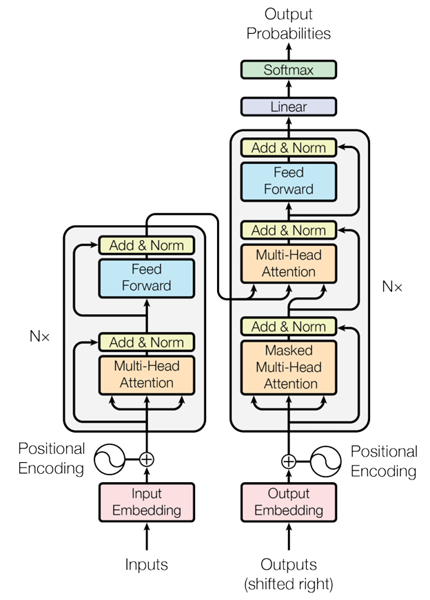

#Implementing "Attention Is All You Need" from Basic Operations to Translating English to Spanish

Inspired by the groundbreaking "Attention Is All You Need" paper by Vaswani et al.  [Read here](https://papers.nips.cc/paper_files/paper/2017/hash/3f5ee243547dee91fbd053c1c4a845aa-Abstract.html), this project implements the Transformer architecture from scratch to perform translation tasks from English to Spanish.

## Dataset
The dataset used in this project is a text file containing English sentences followed by their Spanish translations, separated by a tab. It consists of 118,964 entries, organized from short to long sentences. All the data preprocessing files can be found in dataset directory under src.

## Model
The main training and experimental codes are organized in the src directory. Within the network implementation, two distinct approaches are explored:

* Single-Layer Transformer with Keras:
A one-layer encoder-decoder Transformer is implemented using Keras's built-in MultiHeadAttention function.

* Multi-Layer Modular Transformer (Custom Implementation):
The architecture is extended in the network_architecture_multi_transformer module, where the architecture is modular and can have more or less layers, and all core mechanisms are implemented from scratch. This includes:
  -scaled multi-head attention
  -padding and required maskings
  -masked scaled multi-head self attention
  -positional encodings
  -other foundational components essential for a Transformer based on the paper

To account for padding, custom loss and accuracy functions are defined to ensure proper handling of masked tokens during training and evaluation which can be found in train_model.py.